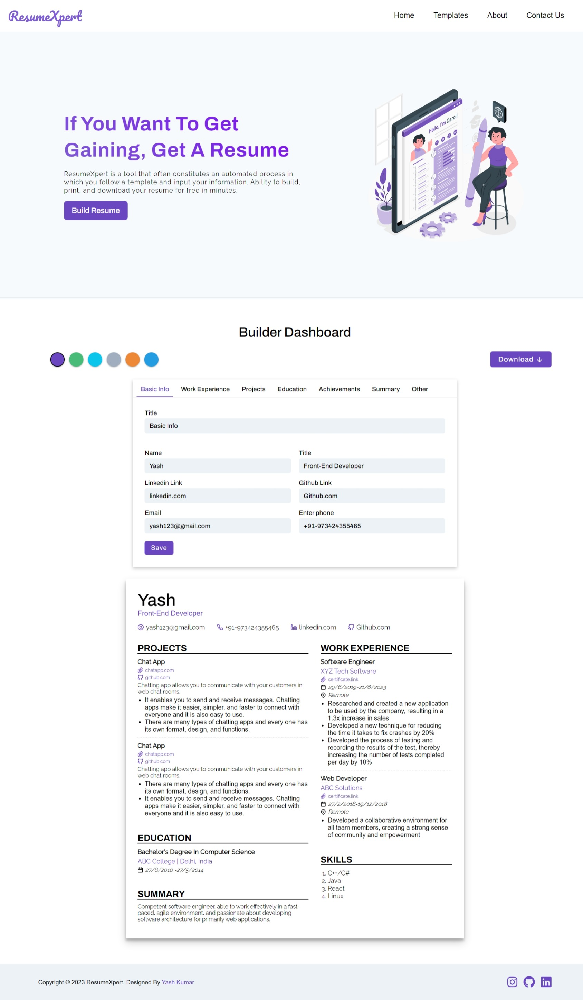

# 📄ResumeXpert

The `ResumeXpert` is a web application that allows you to  generate customized Resume in few minutes on your requirements. It also has ability to build, print, and download your resume in minutes. It is built using the React JavaScript library and offers a range of features to customize and generate resumes efficiently.

## 📸Preview
</img>

## ✨Features

- `Live Resume Preview`:  A live preview feature enables users to see their resume changes in real-time as they make modifications.
- `Drag-and-Drop Functionality`: The application supports a drag-and-drop functionality, allowing users to easily move and reorder sections within the resume.
- `Support Download Functionality`: Once the resume is complete, users can export it as a PDF or download it as a file.
- `Editable Sections`: Users can easily edit and rearrange different sections of their resume, such as personal information, education, work experience, projects, and more.
- `Responsiveness`: The ResumeXpert is designed to be responsive and mobile-friendly.
- `User Feedback/Queries`: Users can send their feedback, questions, or queries through a `contact form`, enabling direct communication with the administrators.

## 🤖Technologies Used

The `ResumeXpert` is built using the following technologies:

- `React.js`: A JavaScript library for building user interfaces.
  Used React features likes states, contexts etc.
- `CSS Modules`: A CSS styling approach that allows for modular and scoped styling in React components.
- `React-To-Print`: Library for printing React components.
- `Vercel`: Platform for deploying React applications.
- `FontAwesome`: Icon library for adding icons to the user interface.
- `React-Feather` - React Icon library for adding icons to the user interface.
- `Firebase Firestore`: Firebase's NoSQL cloud database for storing and syncing data in real-time.
- `React Router`: A library for handling routing in a React application.

## ✨Usage

1. Create a New Resume: Click on the `Build Resume` or scroll down to `Builder Dashboard` to start building a new resume.

2. Edit Resume Sections: Click on each section form to enter your details. Add or remove sections as needed.

3. Customize Section Content: Within each section, you can customize the content by adding relevant information.

4. Preview Your Resume: Use the live preview feature to see how your resume looks in real-time as you make changes.

5. Save Your Resume: Once you are satisfied with your resume, click on the `Download` button, and you can save it to your local device for further use. Alternatively, you can print the resume directly from the downloaded file

6. In Addition, the project includes a `contact us` form where users can send their feedback, questions, or queries directly to the administrators.

## ✨Prerequisites
Before getting started, make sure you have the following prerequisites installed:

- `Firebase`: Create a Firebase account and set up a new project.

## 💻Getting Started

To run the ResumeXpert locally, follow these steps:

1. Clone the repository: `https://github.com/its-kumar-yash/react-resume-builder.git`
2. Navigate to the project directory: `cd react-resume-builder`
3. Install the dependencies: `npm install`
4. Start the development server: `npm start`
5. Open your web browser and visit `http://localhost:3000` to access the ResumeXpert.

## 📑Resources
- [Firebase documentation](https://firebase.google.com/docs)

## ✨Credits
`ResumeXpert` is developed and maintained by `Yash`. Acknowledgements and credits to jigar-sable for design inspiration.

## 📧Contacts
For any inquiries or feedback, please contact [Here](mailto:its.yash.kumar23@gmail.com).